# Roadmap: AI Agent Gateway (Go) — Full Backend

Mục tiêu: **đủ chức năng backend** của cả **goclaw** + **ews-agent** (union), viết bằng Go.

- Có: API, agent loop, providers, tools, MCP, skills, workspace, sessions, memory, security, sandbox, channels, cron/heartbeat, teams/subagent, multi-tenant, progress streaming, CLI…
- **Không làm UI** (`goclaw/ui/web` bỏ qua; không build React dashboard).

Repo tham chiếu:

| Repo | Path |
|------|------|
| goclaw | `/Users/nghia.nguyen2/Public/projectResearch/goclaw` |
| ews-agent | `/Users/nghia.nguyen2/Public/projectResearch/ews-agent` |

**Nguyên tắc học:** mỗi phase = mini-project chạy được; tham chiếu file bên dưới rồi **viết lại bằng Go**, không copy-paste nguyên khối. Song song học **design patterns** của goclaw + ews-agent — xem dòng **Patterns học** ở mỗi phase và **§10**.

---

## 1. Bản đồ chức năng (union 2 repo)

| # | Chức năng | goclaw | ews-agent | Phase làm |
|---|-----------|--------|-----------|-----------|
| 1 | CLI + config + health | có | có | 0 |
| 2 | HTTP API chat (+ OpenAI-compat) | có | có | 1, 6 |
| 3 | WebSocket RPC protocol | có | — | 6 |
| 4 | Session persist | Postgres | file/Redis/Postgres | 2, 10 |
| 5 | LLM multi-provider | có | LiteLLM | 3 |
| 6 | Agent loop think→act→observe | có | có | 4 |
| 7 | Builtin tools (fs/shell/web…) | có | có | 4, 7 |
| 8 | Workspace / context markdown | bootstrap | MAIN/AGENT/… | 5 |
| 9 | Streaming progress events | WS events | SSE + Kafka | 6 |
| 10 | Security (policy, jail, SSRF, injection) | có | có | 7 |
| 11 | MCP bridge | có | có | 8 |
| 12 | Skills (`SKILL.md`) | có | có | 9 |
| 13 | Slash commands | — | có | 9 |
| 14 | Multi-tenant + auth/RBAC | có | có | 10 |
| 15 | Workspace backends file/db/s3 | DB-centric | file/db/s3 | 10 |
| 16 | Memory + embeddings | pgvector | file/S3/mem0 | 11 |
| 17 | Knowledge graph | có | — | 11 |
| 18 | Channels (Telegram…) | có | (Kafka ingress) | 12 |
| 19 | Bus + debounce/dedupe | có | có | 12 |
| 20 | Scheduler lanes | có | có | 13 |
| 21 | Cron + heartbeat | có | external cron tool | 13 |
| 22 | Subagent + team flow | có | có | 14 |
| 23 | Sandbox exec (Docker…) | có | Docker/Monty/ECS | 15 |
| 24 | Media / TTS / browser | có | hạn chế | 16 |
| 25 | Citation | — | có | 16 |
| 26 | Tracing / OTel / metrics | có | timings/metrics | 17 |
| 27 | OAuth / API keys / pairing | có | JWT + admin token | 10, 17 |
| 28 | i18n backend messages | có | — | 17 |
| — | Web UI | `ui/web` | — | **SKIP** |

---

## 2. Cấu trúc repo mới (backend-only)

```
my-agent/
├── main.go
├── cmd/                      # serve, migrate, onboard, doctor, chat, …
├── internal/
│   ├── config/
│   ├── store/                # interfaces + pg/
│   ├── provider/
│   ├── agent/                # loop, router, systemprompt, guard
│   ├── tools/
│   ├── mcp/
│   ├── bootstrap/
│   ├── skills/
│   ├── slash/
│   ├── gateway/              # WS + method router
│   ├── http/                 # REST /v1/*
│   ├── channels/
│   ├── bus/
│   ├── scheduler/
│   ├── cron/
│   ├── heartbeat/
│   ├── memory/
│   ├── knowledgegraph/
│   ├── sandbox/
│   ├── security/
│   ├── citation/
│   ├── progress/             # SSE (+ optional Kafka)
│   ├── media/
│   ├── tts/
│   ├── tracing/
│   ├── permissions/
│   ├── crypto/
│   ├── oauth/
│   ├── i18n/
│   └── cache/
├── pkg/protocol/             # WS frames / events
├── migrations/
├── workspace/                # local persona (dev)
├── skills/                   # bundled skills
└── go.mod
```

Bắt đầu SQLite/file → chuyển Postgres khi Phase 10.

---

## 3. Các phase học & xây (full backend)

### Phase 0 — Nền Go + CLI + Config + Health

**Làm:** `go mod init`, CLI `serve`/`version`, load config từ env/file, `GET /health`.

**Tham chiếu**

| Việc | goclaw | ews-agent |
|------|--------|-----------|
| Entry / CLI | `main.go`, `cmd/root.go` | `ews_agent/cli/entrypoint.py` |
| Gateway boot | `cmd/gateway.go`, `cmd/gateway_setup.go` | `ews_agent/api/__init__.py` (`create_app`, lifespan) |
| Config | `internal/config/config.go`, `config_load.go`, `defaults.go` | `ews_agent/config/settings.py`, `env.example` |
| Health | `internal/gateway/server.go` (`/health`) | `ews_agent/health.py`, route trong `api/__init__.py` |

**Done:** `serve` + `/health` OK.

**Patterns học:** Composition Root / Wiring · Configuration Object · Command (CLI subcommands)

---

### Phase 1 — HTTP Chat API (stub)

**Làm:** `POST /v1/chat` echo; request/response structs; middleware request-id + recover.

**Tham chiếu**

| Việc | goclaw | ews-agent |
|------|--------|-----------|
| Chat HTTP | `internal/http/chat_completions.go` | `POST /v1/chat` trong `ews_agent/api/__init__.py` |
| Auth skeleton | `internal/http/auth.go` | `ews_agent/api/auth.py` |
| Schemas | `pkg/protocol/` (events) | `ews_agent/schemas/agent.py` |
| Errors | `pkg/protocol/errors.go` | `ews_agent/errors/catalog.py`, `response.py` |

**Done:** curl chat nhận `session_id` + reply stub.

**Patterns học:** Middleware Chain · DTO / Schema · Error Catalog · Decorator (recover, request-id)

---

### Phase 2 — Session persistence

**Làm:** bảng `sessions`/`messages`; load history; append sau turn.

**Tham chiếu**

| Việc | goclaw | ews-agent |
|------|--------|-----------|
| Session keys | `internal/sessions/key.go`, `manager.go` | — |
| Store interface | `internal/store/session_store.go` | `ews_agent/protocols.py` (`SessionStoreProtocol`) |
| PG impl | `internal/store/pg/sessions.go`, `sessions_list.go`, `sessions_ops.go` | `ews_agent/persistence/repositories/sessions.py`, `messages.py` |
| File/Redis | — | `ews_agent/infra/session_store.py`, `persistence/redis_session.py` |
| Service layer | — | `ews_agent/services/session_service.py` |
| Migrations | `migrations/000001_*.up.sql` | `alembic/versions/` |

**Done:** restart process, history còn.

**Patterns học:** Repository · Strategy (file/Redis/Postgres) · Protocol / Interface Segregation · Service Layer

---

### Phase 3 — LLM Provider(s)

**Làm:** interface `Provider`; 1 provider OpenAI-compat trước; sau thêm Anthropic; retry/timeout/usage.

**Tham chiếu**

| Việc | goclaw | ews-agent |
|------|--------|-----------|
| Interface / registry | `internal/providers/types.go`, `registry.go`, `retry.go` | `ews_agent/llm/orchestrator.py`, `router_factory.py` |
| OpenAI-compat | `internal/providers/openai.go`, `openai_types.go` | LiteLLM qua `litellm-config.yaml` |
| Anthropic | `internal/providers/anthropic.go`, `anthropic_stream.go` | (qua LiteLLM) |
| DashScope / Codex / ACP / Claude CLI | `dashscope.go`, `codex.go`, `acp_provider.go`, `claude_cli*.go` | — |
| Wire providers | `cmd/gateway_providers.go` | settings + `router_factory.py` |
| LLM logs | `internal/tracing/` | `ews_agent/llm/llm_logging.py`, `infra/llm_log.py` |

**Done:** `/v1/chat` gọi model thật (chưa tools).

**Patterns học:** Strategy (multi-provider) · Registry · Adapter (OpenAI-compat) · Decorator / Retry with backoff · Facade (LiteLLM-style router)

---

### Phase 4 — Agent loop + builtin tools (lõi)

**Làm:** think→act→observe; `maxIterations`; registry tools; builtins: `get_time`, `read_file`, `list_dir`, `write_file`, `web_fetch` (sau).

**Tham chiếu — loop**

| Việc | goclaw | ews-agent |
|------|--------|-----------|
| Orchestrator | `internal/agent/loop.go`, `loop_run.go`, `loop_types.go` | `ews_agent/agent/orchestrator.py`, `single_loop_runner.py` |
| Tool round | `internal/agent/toolloop.go` | `ews_agent/llm/tool_calling_loop.py`, `tool_calls_round.py`, `tool_executor.py` |
| History / prune | `loop_history.go`, `pruning.go`, `loop_compact.go` | `ews_agent/context/pruning.py`, `agent/middleware.py` |
| Router / resolver | `internal/agent/router.go`, `resolver.go` | wiring trong `agent/wiring.py` |
| System prompt | `systemprompt.go`, `systemprompt_sections.go` | `ews_agent/agent/system_prompt.py` |

**Tham chiếu — tools**

| Việc | goclaw | ews-agent |
|------|--------|-----------|
| Registry / policy | `internal/tools/registry.go`, `policy.go`, `types.go` | `ews_agent/tools/manager.py`, `permissions.py`, `base.py` |
| Seed builtins | `cmd/gateway_builtin_tools.go` | `ews_agent/agent/wiring.py` |
| Filesystem | `filesystem.go`, `filesystem_write.go`, `filesystem_list.go`, `edit.go` | `tools/builtins/read_tool.py`, `write_tool.py`, `edit_tool.py`, `list_tool.py`, `glob_tool.py`, `grep_tool.py` |
| Shell / exec | `shell.go`, `shell_deny_groups.go`, `exec_approval.go` | `tools/builtins/bash_tool.py` |
| Web | `web_search.go`, `web_fetch.go` | `tools/builtins/web_search.py` |
| Scrub / rate limit | `scrub.go`, `rate_limiter.go` | `security/output_redaction.py` |

**Done:** model tự gọi tool và trả lời đúng.

**Patterns học:** ReAct (think→act→observe) · Template Method (loop skeleton) · Command (tool call) · Registry (tools) · Chain of Responsibility / Middleware (prune, compact, limits)

---

### Phase 5 — Workspace / context files

**Làm:** load `AGENT.md` / `TOOLS.md` / `USER.md` (+ `MAIN.md`/`SOUL.md` nếu muốn); inject system prompt; path jail workspace.

**Tham chiếu**

| Việc | goclaw | ews-agent |
|------|--------|-----------|
| Bootstrap load/seed | `internal/bootstrap/files.go`, `load_store.go`, `seed.go`, `templates/*.md` | `ews_agent/infra/workspace.py`, `workspace_template.py` |
| Context trong DB | `internal/store/pg/agents_context.go` | grants + CAS trong `persistence/models.py` |
| Request context | — | `ews_agent/context/request_context.py`, `request_workspace.py` |
| Providers file/db/s3 | tenant paths `config/tenant_paths.go` | `infra/workspace_provider.py`, `db_workspace_provider.py`, `s3_workspace_provider.py`, `workspace_provider_factory.py` |
| Interceptors | `internal/tools/context_file_interceptor.go`, `workspace_interceptor.go` | tools đọc ContextVar workspace |
| Sample data | — | `ews_workspace_data/public/.../AGENT.md` v.v. |
| Docs | — | `docs/s3-workspace-backend.md`, `docs/architecture.md` |

**Done:** sửa markdown → đổi hành vi agent, không sửa code.

**Patterns học:** Builder (system prompt sections) · Context Object · Template Method (bootstrap seed files) · Path Jail / Capability-based access

---

### Phase 6 — Streaming: SSE + (sau) WebSocket RPC

**Làm trước SSE** (giống ews-agent), **sau thêm WS protocol** (giống goclaw). Event thống nhất: `run.started`, `chunk`, `tool.call`, `tool.result`, `run.completed`.

**Tham chiếu — SSE / progress**

| Việc | goclaw | ews-agent |
|------|--------|-----------|
| Progress envelope | WS `pkg/protocol/events.go` | `ews_agent/progress/events.py`, `messages.py` |
| Chat stream | `internal/gateway/methods/chat.go` (events) | `POST /v1/chat/stream`, `GET /v1/events/stream` trong `api/__init__.py` |
| Kafka (optional sau) | — | `ews_agent/progress/kafka_worker.py`, `docs/progressive-events-architecture.md` |

**Tham chiếu — WebSocket RPC**

| Việc | goclaw | ews-agent |
|------|--------|-----------|
| Protocol v3 | `pkg/protocol/frames.go`, `methods.go`, `events.go`, `errors.go` | — |
| WS server | `internal/gateway/server.go`, `client.go`, `router.go` | — |
| Method wire | `cmd/gateway_methods.go` | — |
| Chat methods | `internal/gateway/methods/chat.go` | — |
| Docs | `websocket-protocol.md`, `api-reference.md` | — |

**HTTP OpenAI-compat (cùng phase hoặc ngay sau)**

| Việc | goclaw | ews-agent |
|------|--------|-----------|
| `/v1/chat/completions` | `internal/http/chat_completions.go` | gần với `/v1/chat` |
| `/v1/responses` | `internal/http/responses.go` | — |
| `/v1/tools/invoke` | `internal/http/tools_invoke.go` | — |

**Done:** curl/SSE thấy tool + chunk realtime; optional WS `connect` + `chat.send`.

**Patterns học:** Observer / Pub-Sub (progress events) · Adapter (SSE vs WS vs Kafka) · Envelope / Event Sourcing lite · RPC Method Router

---

### Phase 7 — Security đầy đủ (backend)

**Làm:** path jail, shell deny, SSRF, tool allowlist, `POLICY.yaml`, prompt-injection guard, output redaction, input guard.

**Tham chiếu**

| Việc | goclaw | ews-agent |
|------|--------|-----------|
| Input guard | `internal/agent/input_guard.go` | `security/prompt_injection.py`, `prompt_injection_guard.py` |
| Tool policy layers | `internal/tools/policy.go`, `permissions/policy.go` | `tools/permissions.py`, `security/policy.py` |
| POLICY.yaml | — | `POLICY.example.yaml`, load trong `security/policy.py` |
| Path / SSRF | `filesystem.go` (escape), web fetch SSRF helpers | workspace isolation docs |
| Output scrub | `internal/tools/scrub.go`, `agent/sanitize.go` | `security/output_redaction.py` |
| External tools untrusted | — | `security/external_tools.py` |
| Docs | security logs `slog.Warn("security.*")` | `docs/security/README.md`, `docs/security/implementation/*` |

**Done:** test cố ý path escape / SSRF / injection bị chặn.

**Patterns học:** Chain of Responsibility (auth→RBAC→injection→policy→sandbox→redact) · Policy Object / Guard · Decorator (scrub/redact) · Deny-by-default

---

### Phase 8 — MCP

**Làm:** đọc `mcp.json`; connect stdio/HTTP; map tools vào registry; lazy connect; optional BM25 tool search.

**Tham chiếu**

| Việc | goclaw | ews-agent |
|------|--------|-----------|
| Manager / pool | `internal/mcp/manager.go`, `manager_connect.go`, `manager_tools.go`, `pool.go` | `tools/mcp/integration.py`, `auto_integration.py` |
| Bridge | `bridge_server.go`, `bridge_tool.go` | `mcp_json_loader.py`, `simple.py` |
| Tool search | `bm25_index.go`, `mcp_tool_search.go` | — |
| Store / grants | `internal/store/pg/mcp_servers.go`, `mcp_servers_access.go` | — |
| HTTP admin | `internal/http/mcp.go`, `mcp_grants.go`, `mcp_tools.go` | — |
| Config | DB + config | `mcp.json`, `mcp.local.json` |
| Docs | — | `docs/mcp_json_integration.md` |

**Done:** 1 MCP server thật chạy trong agent loop.

**Patterns học:** Bridge / Adapter (MCP protocol ↔ tool interface) · Proxy (lazy connect) · Plugin Registry · Grants / Capability tokens

---

### Phase 9 — Skills + Slash commands

**Làm:** load `SKILL.md` (progressive disclosure); skill search; slash `/help`, `/skills`, `/skill-name` short-circuit trước agent.

**Tham chiếu — skills**

| Việc | goclaw | ews-agent |
|------|--------|-----------|
| Loader / search | `internal/skills/loader.go`, `search.go`, `watcher.go` | `ews_agent/skills/loader.py`, `parser.py`, `registry.py` |
| Deps / runtimes | `dep_checker.go`, `dep_installer.go`, `runtime_check.go` | — |
| Store / grants | `internal/store/pg/skills*.go` | `persistence/repositories/skills.py`, `grants.py` |
| HTTP | `internal/http/skills.go`, `skills_grants.go`, `skills_upload.go` | — |
| Bundled | `skills/{docx,pdf,...}/` | `ews_agent/skills/*/SKILL.md` |
| Tools | `internal/tools/skill_search.go`, `use_skill.go`, … | skill content qua `read` |
| Docs | — | `ews_agent/skills/README.md`, `docs/SYSTEM_SKILLS_IMPLEMENTATION.md` |

**Tham chiếu — slash**

| Việc | goclaw | ews-agent |
|------|--------|-----------|
| Ingress / dispatch | — | `ews_agent/slash/ingress.py`, `detection.py`, `dispatch.py` |
| Builtins | — | `slash/builtin_registry.py`, `skill_commands.py` |
| Bridges | — | `slash/http_bridge.py`, `cli_bridge.py`, `kafka_bridge.py` |
| Docs | — | `docs/SLASH_COMMANDS_SETUP.md` |

**Done:** skill inject metadata; `/skills` hoạt động trên HTTP + CLI.

**Patterns học:** Progressive Disclosure (skill metadata trước, body khi cần) · Plugin / Registry · Command (slash short-circuit) · Chain of Responsibility (ingress trước agent)

---

### Phase 10 — Multi-tenant, Auth, RBAC, Postgres, API keys

**Làm:** Postgres; JWT/API key; user_id từ auth (không tin body); workspace `public|private/{user}/{agent}`; agents CRUD; encrypted provider keys; RBAC admin/operator/viewer.

**Tham chiếu**

| Việc | goclaw | ews-agent |
|------|--------|-----------|
| Ctx keys | `internal/store/context.go` | identity qua auth + ContextVar |
| Auth HTTP | `internal/http/auth.go`, `api_key_cache.go` | `ews_agent/api/auth.py` |
| RBAC | `internal/permissions/policy.go` | `docs/security/implementation/api-rbac.md` |
| Crypto keys | `internal/crypto/aes.go`, `apikey.go` | — |
| Tenants | `internal/http/tenants.go`, `gateway/methods/tenants.go`, migrations tenant | `schemas/identity.py`, `api/user_provisioning.py` |
| Grants | MCP/skills grants trong store/http | `persistence/repositories/grants.py`, `models.py` |
| Pairing devices | `gateway/methods/pairing.go`, `cmd/pairing.go` | — |
| API keys RPC/HTTP | `methods/api_keys.go`, `http/api_keys.go` | `Settings.admin_token` |
| OAuth | `internal/oauth/openai.go`, `http/oauth.go`, `cmd/auth.go` | — |
| Agents HTTP | `internal/http/agents.go`, `agents_sharing.go`, `agents_instances.go` | agent_id trong chat body + workspace |
| Docs | — | `docs/multi-agent-multi-user/*` |

**Done:** 2 user không đọc được session/workspace của nhau.

**Patterns học:** Multi-tenancy (row-level + path-scoped) · Gateway + AuthN/AuthZ · RBAC · Repository (agents/grants) · Secrets Vault pattern (encrypted provider keys)

---

### Phase 11 — Memory + Knowledge Graph

**Làm:** memory write/search/get; embeddings; optional KG extract + traverse.

**Tham chiếu**

| Việc | goclaw | ews-agent |
|------|--------|-----------|
| Embeddings | `internal/memory/embeddings.go` | (mem0 / provider) |
| Memory tools | `internal/tools/memory.go`, `memory_interceptor.go` | `ews_agent/memory/tools.py` |
| Memory manager | — | `memory/manager.py`, `flush.py` |
| Providers | PG: `store/pg/memory_docs.go`, `memory_search.go` | `memory/providers/file_provider.py`, `s3_provider.py`, `mem0.py` |
| Memory HTTP | `internal/http/memory.go`, `memory_handlers.go` | — |
| KG extract | `internal/knowledgegraph/extractor.go` | — |
| KG store | `store/pg/knowledge_graph.go`, `knowledge_graph_traversal.go` | — |
| KG tool / HTTP | `tools/knowledge_graph.go`, `http/knowledge_graph.go` | — |
| Migrations | `migrations/000013_knowledge_graph.up.sql`, `000025_*.sql` | — |

**Done:** agent nhớ được qua `memory_search`; optional KG query.

**Patterns học:** Pipeline (extract→embed→store→retrieve) · Repository + Vector Search · Knowledge Graph (entity/relation) · Top-k Context Injection (không dump toàn bộ memory)

---

### Phase 12 — Bus + Channels (Telegram trước, rồi đủ set)

**Làm:** inbound bus → normalize → agent → outbound; Telegram trước; sau: Discord, Slack, Feishu, WhatsApp, Zalo.

**Tham chiếu**

| Việc | goclaw | ews-agent |
|------|--------|-----------|
| Bus | `internal/bus/bus.go`, `types.go`, `dedupe.go`, `inbound_debounce.go` | `runtime/inbound_flow.py` (debounce/dedupe); Kafka như channel async |
| Consumer | `cmd/gateway_consumer*.go` | `progress/kafka_worker.py` |
| Channel manager | `internal/channels/manager.go`, `dispatch.go`, `channel.go` | — |
| Telegram | `internal/channels/telegram/*` | — |
| Feishu | `internal/channels/feishu/*` | — |
| Discord | `internal/channels/discord/*` | — |
| Slack | `internal/channels/slack/*` | — |
| WhatsApp | `internal/channels/whatsapp/*` | — |
| Zalo | `internal/channels/zalo/*` | — |
| Media/STT/typing | `channels/media/*`, `channels/typing/*` | — |
| HTTP channel admin | `http/channel_instances.go`, `methods/channels.go` | — |
| Kafka ingress (optional) | — | `kafka_worker.py` + compose `docker-compose.kafka.yml` |

**Done:** nhắn Telegram = cùng agent loop với HTTP.

**Patterns học:** Adapter (channel platforms) · Mediator / Message Bus · Normalize Inbound · Debounce + Deduplicate · Ports & Adapters (channel ≠ agent logic)

---

### Phase 13 — Scheduler lanes + Cron + Heartbeat

**Làm:** lanes `main` / `subagent` / `cron` (/ `research`); per-session queue; cron jobs; heartbeat checklist.

**Tham chiếu**

| Việc | goclaw | ews-agent |
|------|--------|-----------|
| Scheduler | `internal/scheduler/scheduler.go`, `lanes.go`, `queue.go` | `runtime/scheduler.py`, `lanes.py`, `session_queue.py`, `classifier.py` |
| Idempotency / locks | — | `runtime/idempotency.py`, `workspace_lock.py` |
| Cancel / stats API | — | `POST /v1/scheduler/cancel`, `GET /v1/scheduler/stats` |
| Cron service | `internal/cron/service.go`, `service_execution.go` | external: `tools/builtins/scheduler_http_tool.py` |
| Cron store / CLI | `store/pg/cron*.go`, `cmd/cron_cmd.go`, `methods/cron.go` | docs `docs/external-cron-*.md` |
| Cron tool | `internal/tools/cron.go` | `scheduler_http_tool.py` |
| Heartbeat | `internal/heartbeat/ticker.go`, `tools/heartbeat.go`, `methods/heartbeat.go` | `HEARTBEAT.md` trong workspace (prompt) |
| Docs | — | `docs/lane-scheduler-implementation-*.md`, `docs/mechanisms-adoption-guide.md` |

**Done:** concurrent runs có lane limit; cron/heartbeat chạy đúng.

**Patterns học:** Scheduler Lanes · Worker Pool · Per-session FIFO Queue · Idempotency · Job / Cron pattern · Synthetic Request (cron → RunRequest chung)

---

### Phase 14 — Subagent + Team flow

**Làm:** tool spawn/hire subagent; team tasks board (goclaw) **và/hoặc** Planner→Workers→Evaluator (ews-agent).

**Tham chiếu**

| Việc | goclaw | ews-agent |
|------|--------|-----------|
| Subagent tools | `internal/tools/subagent.go`, `subagent_spawn_tool.go`, `subagent_exec.go`, `subagent_control.go` | `tools/builtins/hire_sub_agent_tool.py`, `agent/sub_agent_runtime.py` |
| Team tasks | `tools/team_tasks_*.go`, `team_tool_*.go`, `announce_queue.go` | — |
| Team store | `store/pg/teams.go`, `teams_tasks*.go` | — |
| Team RPC/HTTP | `gateway/methods/teams*.go`, `http/team_*.go` | — |
| Research flow | — | `agent/team_flow/flow.py`, `planner.py`, `evaluator.py`, `schema.py` |
| Docs | — | `docs/hire-team-research-flow.md`, `docs/sub-agent-implementation.md` |

**Done:** 1 parent hire được worker; có ít nhất 1 team/research path.

**Patterns học:** Hierarchical / Composite Agent · Planner–Worker–Evaluator (Orchestrator) · Fan-out / Fan-in · Isolation Context (child session) · Cancellation Propagation

---

### Phase 15 — Sandbox execution

**Làm:** Docker sandbox cho `exec`/`bash`/`python_exec`; pool container; path mount workspace.

**Tham chiếu**

| Việc | goclaw | ews-agent |
|------|--------|-----------|
| Sandbox core | `internal/sandbox/sandbox.go`, `docker.go`, `docker_resolve.go`, `fsbridge.go` | `execution/abstraction.py`, `factory.py`, `docker_executor.py`, `docker_pool.py` |
| Python / Monty | — | `python_docker_executor.py`, `python_monty_runner.py`, `python_worker_api.py`, `tools/builtins/python_monty_tool.py` |
| ECS | — | `execution/ecs_executor.py` |
| Images | `Dockerfile.sandbox`, `docker-compose.sandbox.yml` | `Dockerfile.python_exec_worker`, `docker/python_exec_worker/` |
| Docs | — | `docs/design/SANDBOX_EXECUTION_DESIGN.md`, `docs/security/implementation/execution-sandbox.md` |

**Done:** shell/python chạy trong container, không trên host trần.

**Patterns học:** Sandbox / Isolation · Strategy (Docker / Monty / ECS) · Capability Dropping · Resource Quotas

---

### Phase 16 — Media, TTS, Browser, Citation

**Làm (backend APIs + tools, không UI):** upload/serve media; TTS providers; browser tool; citation pipeline (từ ews-agent).

**Tham chiếu**

| Việc | goclaw | ews-agent |
|------|--------|-----------|
| Media loop | `internal/agent/loop_media.go`, `media.go` | — |
| Media tools | `tools/read_image.go`, `read_document*.go`, `create_image*.go`, … | — |
| Media HTTP | `http/media_upload.go`, `media_serve.go`, `internal/media/store.go` | — |
| TTS | `internal/tts/manager.go`, `openai.go`, `elevenlabs.go`, `edge.go`, `minimax.go`, `tools/tts.go` | — |
| Browser | `pkg/browser/*`, tool wire | — |
| Citation | — | `ews_agent/citation/schemas.py`, `mapping.py`, `hooks.py`, `postprocessor.py`, `refs.py` |

**Done:** upload ảnh phân tích được; TTS tool OK; citation gắn nguồn (nếu domain cần).

**Patterns học:** Strategy (TTS providers) · Pipeline (citation post-process) · Media Handler · Tool Facade (browser)

---

### Phase 17 — Observability, Cache, i18n, Harden, CLI đầy đủ

**Làm:** tracing/spans/cost; optional OTel; Redis cache; i18n error catalog; doctor/onboard/migrate; OpenAPI.

**Tham chiếu**

| Việc | goclaw | ews-agent |
|------|--------|-----------|
| Tracing | `internal/tracing/collector.go`, `cost.go`, `otelexport/` | `runtime/metrics.py`, `request_timings.py` |
| Traces HTTP | `internal/http/traces.go`, `usage.go`, `activity.go` | — |
| Cache | `internal/cache/cache.go`, `redis.go`, `permission_cache.go` | Redis trong session/idempotency/workspace |
| i18n | `internal/i18n/keys.go`, `catalog_en.go`, `catalog_vi.go`, `catalog_zh.go` | — |
| OpenAPI | `internal/http/openapi.go`, `openapi_spec.json` | — |
| Upgrade gate | `internal/upgrade/version.go`, `checker.go`, `cmd/migrate.go`, `cmd/upgrade.go` | Alembic |
| CLI đầy đủ | `cmd/onboard.go`, `doctor.go`, `agent.go`, `sessions_cmd.go`, `skills_cmd.go`, `channels_cmd.go`, `models.go`, `config_cmd.go` | `cli/commands/*`, `docs/cli-usage.md` |
| Hardening docs | `CLAUDE.md` checklist | `docs/operational-hardening-checklist.md` |

**Done:** migrate/doctor ổn; có trace + metrics cơ bản; CLI cover ops chính.

**Patterns học:** Observer (metrics/traces) · Cross-cutting Concerns (OTel) · Facade (CLI ops) · Health / Doctor checks · Schema Version Gate (migrate)

---

## 4. Checklist full backend (đánh dấu khi port xong)

### A. Core runtime
- [ ] Agent loop + toolloop + compact/prune/summarize — goclaw `internal/agent/*` · ews `single_loop_runner.py` + `tool_calling_loop.py`
- [ ] Router/resolver/active runs — goclaw `router.go`, `resolver.go`
- [ ] System prompt sections — goclaw `systemprompt*.go` · ews `system_prompt.py`
- [ ] Middleware limits/auto-compact — ews `agent/middleware.py`

### B. Providers
- [ ] OpenAI-compat, Anthropic, DashScope, Codex, ACP, Claude CLI — goclaw `internal/providers/*`
- [ ] LiteLLM-style router config — ews `llm/router_factory.py`, `litellm-config.yaml`

### C. Tools
- [ ] FS / edit / glob / grep / bash / web — cả 2
- [ ] Memory / KG / sessions / cron / heartbeat / skills / subagent / team — goclaw `internal/tools/*`
- [ ] hire_sub_agent + scheduler_http + python_exec — ews `tools/builtins/*`
- [ ] Browser — goclaw `pkg/browser`

### D. MCP / Skills / Slash
- [ ] MCP manager + grants + HTTP admin — goclaw `internal/mcp`, `http/mcp*.go`
- [ ] mcp.json auto-integrate — ews `tools/mcp/*`
- [ ] Skills loader/search/versions/grants — cả 2
- [ ] Slash commands — ews `slash/*`

### E. Ingress
- [ ] HTTP `/v1/chat`, stream, OpenAI-compat, tools invoke — cả 2 / goclaw http
- [ ] WS protocol + methods (chat, agents, sessions, cron, teams, …) — goclaw `pkg/protocol`, `gateway/methods/*`
- [ ] Kafka workers (optional) — ews `progress/kafka_worker.py`
- [ ] Channels: Telegram, Feishu, Discord, Slack, WhatsApp, Zalo — goclaw `internal/channels/*`

### F. Data & tenancy
- [ ] Store interfaces + PG — goclaw `internal/store`, `store/pg`
- [ ] Migrations + schema version gate — goclaw `migrations/`, `upgrade/version.go`
- [ ] Workspace file/db/s3 — ews `infra/*workspace*`
- [ ] Auth JWT/API key + RBAC + pairing + crypto — goclaw permissions/crypto/pairing · ews `api/auth.py`
- [ ] Grants public/private — ews `repositories/grants.py` · goclaw skills/MCP grants

### G. Background & multi-agent
- [ ] Lanes + session queue + idempotency — cả 2 scheduler/runtime
- [ ] Cron + heartbeat — goclaw `cron`, `heartbeat`
- [ ] Team flow research — ews `agent/team_flow/*`
- [ ] Team tasks board — goclaw teams tools/store

### H. Safety & exec
- [ ] POLICY + injection + redaction — ews `security/*` · goclaw input_guard + tool policy
- [ ] Docker sandbox — cả 2
- [ ] Citation — ews `citation/*`

### I. Ops
- [ ] Tracing/OTel/usage — goclaw `tracing`, `http/traces.go`
- [ ] TTS/media — goclaw `tts`, `media`, media tools
- [ ] i18n catalogs — goclaw `internal/i18n`
- [ ] CLI onboard/doctor/migrate/… — goclaw `cmd/*` · ews `cli/*`
- [ ] ~~Web UI~~ — **SKIP** (`goclaw/ui/web`)

---

## 5. File “đọc trước” theo phase (1–2 file/lần)

| Phase | Đọc goclaw trước | Đọc ews-agent trước |
|-------|------------------|---------------------|
| 0 | `cmd/gateway.go` (đầu file) | `config/settings.py` |
| 1 | `http/chat_completions.go` | `api/__init__.py` (routes) |
| 2 | `store/pg/sessions.go` | `services/session_service.py` |
| 3 | `providers/types.go` + `openai.go` | `llm/orchestrator.py` |
| 4 | `agent/loop.go` + `tools/registry.go` | `tool_calling_loop.py` + `tools/manager.py` |
| 5 | `bootstrap/files.go` | `agent/system_prompt.py` + `context/request_context.py` |
| 6 | `pkg/protocol/frames.go` + `methods/chat.go` | `progress/events.py` |
| 7 | `tools/policy.go` + `agent/input_guard.go` | `security/policy.py` + `prompt_injection_guard.py` |
| 8 | `mcp/manager.go` | `tools/mcp/mcp_json_loader.py` |
| 9 | `skills/loader.go` | `skills/registry.py` + `slash/ingress.py` |
| 10 | `permissions/policy.go` + `http/auth.go` | `api/auth.py` + `repositories/grants.py` |
| 11 | `store/pg/memory_search.go` | `memory/manager.py` |
| 12 | `channels/manager.go` + `bus/bus.go` | `runtime/inbound_flow.py` |
| 13 | `scheduler/scheduler.go` + `cron/service.go` | `runtime/scheduler.py` |
| 14 | `tools/subagent_spawn_tool.go` | `team_flow/flow.py` + `hire_sub_agent_tool.py` |
| 15 | `sandbox/docker.go` | `execution/docker_executor.py` |
| 16 | `tts/manager.go` + `pkg/browser/tool.go` | `citation/postprocessor.py` |
| 17 | `tracing/collector.go` + `i18n/keys.go` | `runtime/metrics.py` |

---

## 6. Thứ tự ưu tiên (full nhưng không loạn)

```text
MVP lõi (bắt buộc trước)
  Phase 0 → 1 → 2 → 3 → 4 → 5 → 6 → 7

Mở rộng agent
  Phase 8 → 9 → 11 → 14 → 15 → 16(citation)

Gateway production
  Phase 10 → 12 → 13 → 17 → 16(media/tts/browser)

Optional / sau cùng
  Kafka parity (ews), mọi channel còn lại, ACP/Claude CLI providers, OTel
```

Đến hết **Phase 7** bạn đã có xương sống giống cả 2.  
Đến hết **Phase 17** = **full backend union**, không UI.

---

## 7. Phụ lục — WS methods & HTTP surfaces (goclaw) cần port (backend)

### WebSocket methods (`pkg/protocol/methods.go` + `internal/gateway/methods/`)
- `connect`, health/status
- `chat.send|history|abort|inject` → `methods/chat.go`
- agents CRUD + files + identity + links → `methods/agents*.go`, `agent_links.go`
- `sessions.*` → `methods/sessions.go`
- `config.*` + permissions → `methods/config.go`, `config_permissions.go`
- `skills.*` → `methods/skills.go`
- `cron.*` → `methods/cron.go`
- `channels.*` + instances → `methods/channels.go`, `channel_instances.go`
- `device.pair.*` → `methods/pairing.go`
- `exec.approval.*` → `methods/exec_approval.go`
- `usage` / quota → `methods/usage.go`, `quota_methods.go`
- `heartbeat.*` → `methods/heartbeat.go`
- `teams.*` → `methods/teams*.go`
- `api_keys.*` → `methods/api_keys.go`
- `tenants.*` → `methods/tenants.go`
- `send`, `logs.tail` → `methods/send.go`, `logs.go`

### HTTP (`internal/http/` + `cmd/gateway_http_handlers.go`)
- `/v1/chat/completions`, `/v1/responses`, `/v1/tools/invoke`
- agents, skills, providers, MCP, memory, KG, media, files, traces, usage, tenants, oauth, api_keys, channel_instances, builtin_tools, openapi

### ews-agent HTTP (`ews_agent/api/__init__.py`)
- `GET /health`
- `POST /v1/chat`, `POST /v1/chat/stream`
- `GET /v1/events/stream`
- `POST /v1/scheduler/cancel`, `GET /v1/scheduler/stats`

Khi port: giữ **một** surface chính (HTTP + SSE trước), rồi thêm WS methods theo nhóm ở trên.

---

## 8. Ước lượng (part-time ~10h/tuần)

| Cụm | Phase | Thời gian | Kết quả |
|-----|-------|-----------|---------|
| Nền + MVP | 0–7 | ~2–3 tháng | Agent gateway stream + secure |
| Agent nâng cao | 8–9, 11, 14–15 | ~1.5–2 tháng | MCP, skills, memory, team, sandbox |
| Production gateway | 10, 12–13, 16–17 | ~2–3 tháng | Multi-tenant, channels, cron, media, ops |
| **Tổng** | | **~6–8 tháng** | Full backend parity (không UI) |

---

## 9. Luồng tổng thể để hình dung khi xây

### 9.1 Kiến trúc backend hoàn chỉnh

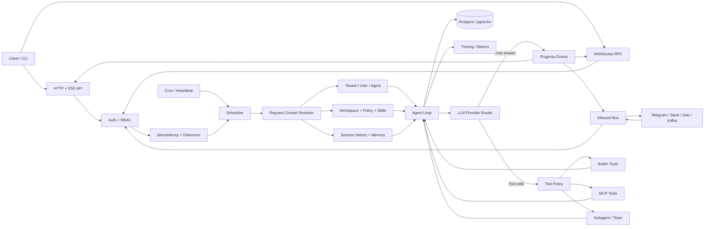

**Cách hiểu:** HTTP, WS, channel, cron chỉ là các cổng vào. Tất cả cuối cùng phải hội tụ vào một pipeline chung:  
`Auth → Resolve context → Scheduler → Agent loop → Provider/Tools → Persist → Emit response`.

---

### 9.2 Luồng khởi động server

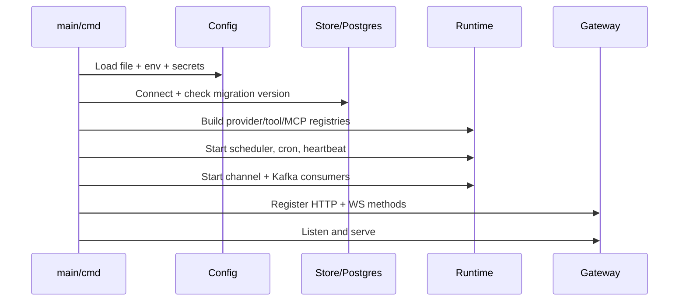

**Tham chiếu:**  
goclaw `main.go`, `cmd/gateway.go`, `cmd/gateway_setup.go`, `cmd/gateway_methods.go`  
ews-agent `ews_agent/api/__init__.py` (`create_app`, lifespan), `ews_agent/config/settings.py`

---

### 9.3 Luồng chat HTTP/SSE end-to-end

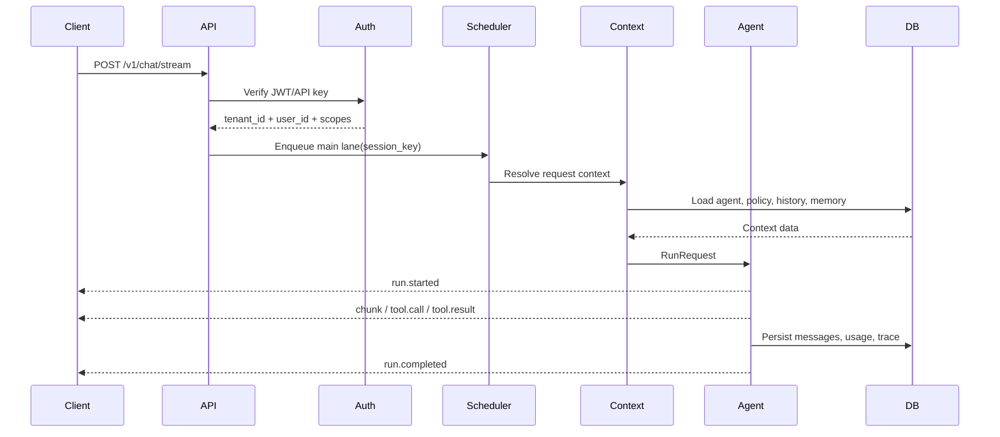

**Quy tắc quan trọng:**

1. `user_id` lấy từ auth, không lấy từ body.
2. Scheduler serialize các request cùng `session_key`.
3. Nếu client disconnect, cancel `context.Context`.
4. Chỉ persist assistant message sau khi run thành công; lỗi phải có trạng thái/audit riêng.

**Tham chiếu:**  
goclaw `internal/http/chat_completions.go`, `internal/gateway/methods/chat.go`, `internal/agent/loop_run.go`  
ews-agent `ews_agent/api/__init__.py`, `agent/orchestrator.py`, `context/request_context.py`

---

### 9.4 Luồng bên trong Agent Loop

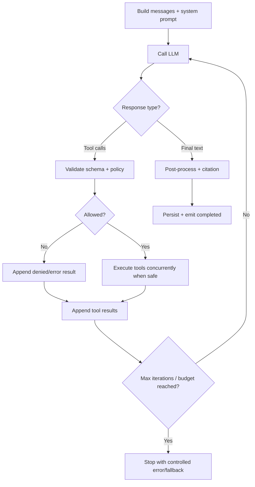

Pseudo-flow:

```go
for iteration := 0; iteration < maxIterations; iteration++ {
    response := provider.Chat(ctx, messages, toolSchemas)
    if len(response.ToolCalls) == 0 {
        return finalize(response)
    }
    results := toolExecutor.Execute(ctx, response.ToolCalls)
    messages = append(messages, response.Message, results...)
}
return ErrMaxIterations
```

**Tham chiếu:**  
goclaw `internal/agent/loop.go`, `toolloop.go`, `loop_history.go`, `loop_compact.go`  
ews-agent `ews_agent/llm/tool_calling_loop.py`, `tool_calls_round.py`, `tool_executor.py`

---

### 9.5 Luồng tạo request context và system prompt

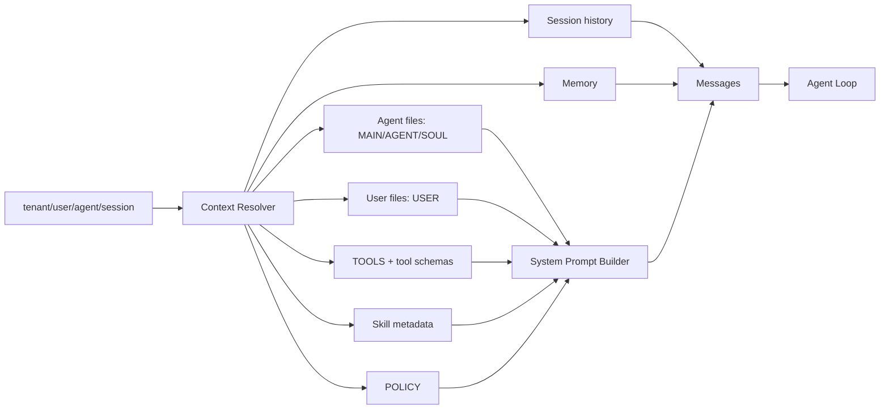

**Tách dữ liệu:**

- Public/shared: persona, agent definition, public skills.
- Private: user profile, policy, memory, session, credentials.
- Không đưa secret vào system prompt.
- Skill chỉ inject metadata; đọc body khi cần (progressive disclosure).

**Tham chiếu:**  
goclaw `internal/bootstrap/*`, `internal/agent/systemprompt*.go`, `internal/store/pg/agents_context.go`  
ews-agent `agent/system_prompt.py`, `context/request_context.py`, `infra/workspace*.py`

---

### 9.6 Luồng tool và MCP

```mermaid
sequenceDiagram
    participant Loop as Agent Loop
    participant Registry as Tool Registry
    participant Policy
    participant Builtin
    participant MCP

    Loop->>Registry: Execute(name, JSON args)
    Registry->>Policy: Check tenant/agent/channel/user rules
    alt denied
        Policy-->>Loop: Structured denied result
    else builtin
        Policy->>Builtin: Execute with timeout/sandbox
        Builtin-->>Loop: Sanitized ToolResult
    else MCP
        Policy->>MCP: Lazy connect + tools/call
        MCP-->>Loop: Sanitized ToolResult
    end
```

Tool execution cần có: JSON schema validation, timeout, cancellation, size limit, redaction, audit, rate limit và sandbox khi có side effect.

**Tham chiếu:**  
goclaw `internal/tools/registry.go`, `policy.go`, `internal/mcp/manager*.go`  
ews-agent `tools/manager.py`, `tools/permissions.py`, `tools/mcp/integration.py`

---

### 9.7 Luồng channel (Telegram/Slack/Zalo...)

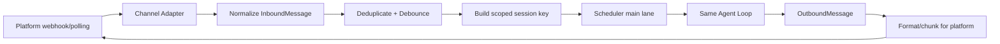

Channel adapter **không chứa agent logic**. Nó chỉ nhận/gửi, chuẩn hóa identity, media và format output.

**Tham chiếu:**  
goclaw `internal/channels/manager.go`, `dispatch.go`, `internal/bus/*`, `cmd/gateway_consumer*.go`  
ews-agent `runtime/inbound_flow.py`, `progress/kafka_worker.py`

---

### 9.8 Luồng scheduler, idempotency và concurrency

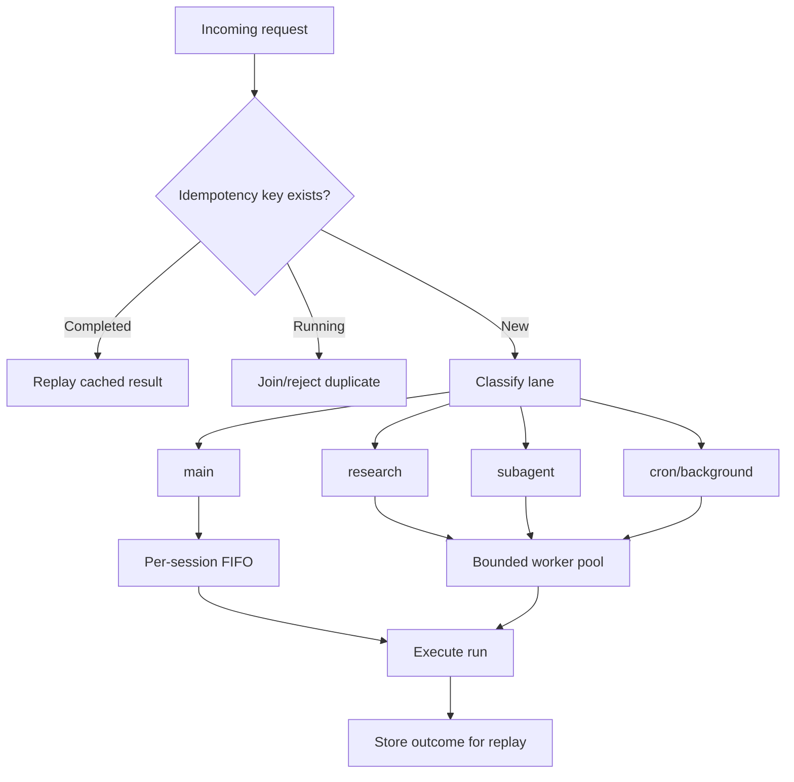

Mục tiêu: cùng session không ghi history đè nhau; toàn hệ thống có giới hạn concurrency; retry không tạo run trùng.

**Tham chiếu:**  
goclaw `internal/scheduler/scheduler.go`, `lanes.go`, `queue.go`  
ews-agent `runtime/scheduler.py`, `session_queue.py`, `idempotency.py`, `classifier.py`

---

### 9.9 Luồng cron và heartbeat

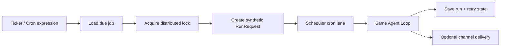

Cron/heartbeat không gọi provider trực tiếp; luôn tạo `RunRequest` và đi qua pipeline chung.

**Tham chiếu:**  
goclaw `internal/cron/service*.go`, `internal/heartbeat/ticker.go`, `cmd/gateway_cron.go`  
ews-agent `tools/builtins/scheduler_http_tool.py`, tài liệu `docs/external-cron-*.md`

---

### 9.10 Luồng subagent / team research

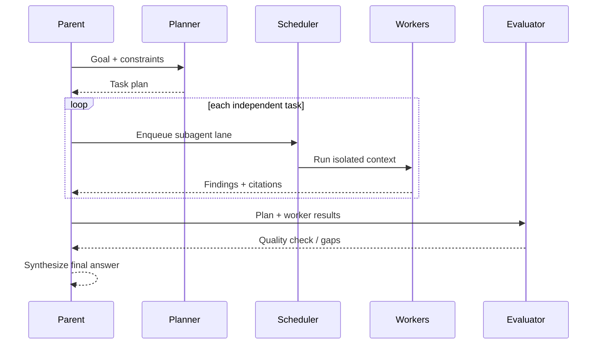

Mỗi subagent cần: session/context riêng, depth limit, concurrency limit, budget, cancellation propagation và trace liên kết parent/child.

**Tham chiếu:**  
goclaw `internal/tools/subagent*.go`, `team_tasks_*.go`, `internal/store/pg/teams*.go`  
ews-agent `agent/team_flow/flow.py`, `planner.py`, `evaluator.py`, `agent/sub_agent_runtime.py`

---

### 9.11 Luồng memory và knowledge graph

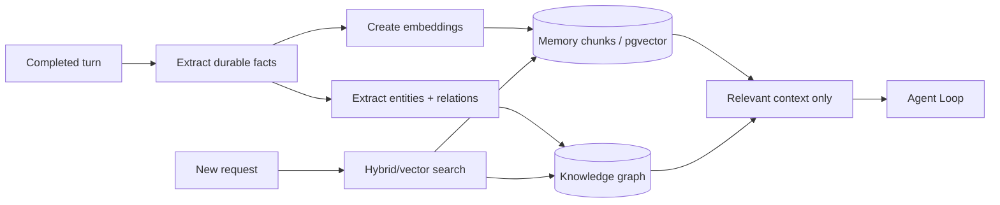

Không inject toàn bộ memory. Chỉ lấy top-k theo tenant/user/agent scope và giới hạn token.

**Tham chiếu:**  
goclaw `internal/memory/embeddings.go`, `store/pg/memory_search.go`, `internal/knowledgegraph/*`  
ews-agent `memory/manager.py`, `memory/flush.py`, `memory/providers/*`

---

### 9.12 Luồng security nhiều lớp

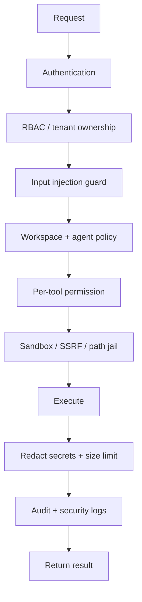

Không xem prompt-injection detector là lớp bảo vệ duy nhất. Boundary thật nằm ở auth, ownership, tool policy, sandbox và output redaction.

**Tham chiếu:**  
goclaw `internal/permissions/policy.go`, `internal/tools/policy.go`, `internal/agent/input_guard.go`  
ews-agent `security/policy.py`, `prompt_injection_guard.py`, `output_redaction.py`

---

### 9.13 Luồng dữ liệu multi-tenant

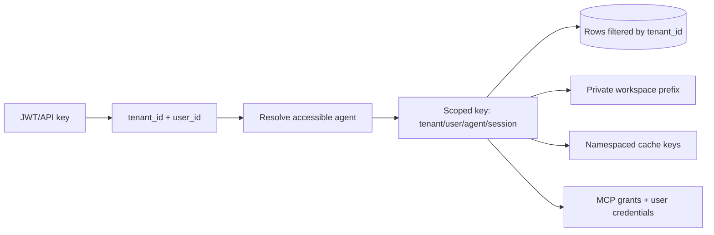

Mọi bảng, cache key, workspace path, session key, trace và job phải mang tenant scope. Không dựa vào filter ở UI/client.

**Tham chiếu:**  
goclaw `internal/store/context.go`, `internal/http/auth.go`, `internal/http/tenants.go`  
ews-agent `api/auth.py`, `schemas/identity.py`, `api/user_provisioning.py`, `repositories/grants.py`

---

### 9.14 Luồng lỗi và hủy request

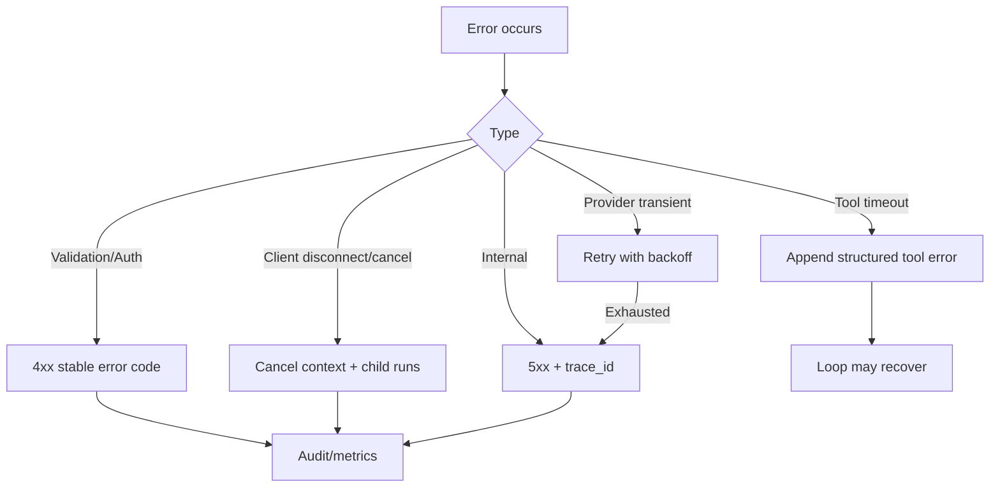

Không trả stack trace hoặc secret ra client. Error response nên có `code`, `message`, `retryable`, `trace_id`.

**Tham chiếu:**  
goclaw `pkg/protocol/errors.go`, `internal/providers/retry.go`  
ews-agent `errors/catalog.py`, `errors/response.py`, `runtime/errors.py`

---

### 9.15 Luồng triển khai theo từng milestone

```mermaid
flowchart LR
    M1[HTTP echo] --> M2[Session DB]
    M2 --> M3[LLM chat]
    M3 --> M4[Agent + tools]
    M4 --> M5[Workspace prompt]
    M5 --> M6[SSE streaming]
    M6 --> M7[Security]
    M7 --> M8[MCP + skills]
    M8 --> M9[Multi-tenant]
    M9 --> M10[Memory + channels]
    M10 --> M11[Scheduler + cron]
    M11 --> M12[Subagent + sandbox]
    M12 --> M13[Media + tracing + hardening]
```

Ở mỗi milestone luôn giữ một đường chạy dọc hoàn chỉnh: `request → loop → persistence → response`; không xây hết store hoặc hết tools theo chiều ngang rồi mới tích hợp.

---

## 10. Design Patterns học được từ goclaw + ews-agent

Mỗi phase ở **§3** đã gắn dòng **Patterns học**. Mục này giải thích *pattern là gì*, *xuất hiện ở đâu trong 2 repo*, và *bạn nên học gì khi viết lại bằng Go*.

### 10.1 Bản đồ nhanh: Phase → Pattern → Repo nguồn

| Phase | Pattern chính | Chủ yếu từ | File / module điển hình |
|-------|---------------|------------|-------------------------|
| 0 | Composition Root, Config Object, Command (CLI) | cả 2 | goclaw `cmd/gateway*.go` · ews `api/__init__.py` `create_app` |
| 1 | Middleware Chain, DTO, Error Catalog | cả 2 | goclaw `http/*`, `protocol/errors` · ews `errors/catalog.py` |
| 2 | Repository, Strategy (store backends), Protocol | cả 2 | goclaw `store/*` · ews `SessionStoreProtocol`, `session_service` |
| 3 | Strategy, Registry, Adapter, Retry Decorator, Facade | cả 2 | goclaw `providers/*` · ews `llm/orchestrator`, LiteLLM router |
| 4 | **ReAct loop**, Template Method, Command (tools), Registry, Middleware | cả 2 | goclaw `agent/loop*`, `tools/registry` · ews `tool_calling_loop` |
| 5 | Builder (prompt), Context Object, Bootstrap Template | cả 2 | goclaw `bootstrap/*`, `systemprompt*` · ews `system_prompt`, `request_context` |
| 6 | Observer/Pub-Sub, Adapter (transport), RPC Router | cả 2 | goclaw `pkg/protocol`, WS methods · ews `progress/events`, SSE |
| 7 | Chain of Responsibility, Policy/Guard, Deny-by-default | cả 2 | goclaw `input_guard`, `tools/policy` · ews `security/*` |
| 8 | Bridge/Adapter (MCP), Proxy (lazy), Plugin Registry | cả 2 | goclaw `mcp/manager*` · ews `tools/mcp/*` |
| 9 | Progressive Disclosure, Plugin, Command (slash), CoR ingress | cả 2 / slash=ews | goclaw `skills/*` · ews `skills/*`, `slash/*` |
| 10 | Multi-tenancy, RBAC, Gateway Auth, Secrets Vault | cả 2 | goclaw `permissions`, `http/auth` · ews `api/auth`, `grants` |
| 11 | Pipeline (memory), Vector Repository, KG | cả 2 / KG=goclaw | goclaw `memory`, `knowledgegraph` · ews `memory/*` |
| 12 | Channel Adapter, Message Bus, Normalize, Debounce/Dedupe | cả 2 | goclaw `channels/*`, `bus/*` · ews `inbound_flow`, Kafka |
| 13 | Lanes, Worker Pool, FIFO Queue, Idempotency, Cron Job | cả 2 | goclaw `scheduler`, `cron` · ews `runtime/scheduler`, `idempotency` |
| 14 | Hierarchical Agent, Planner–Worker–Evaluator, Fan-out/in | cả 2 | goclaw `subagent*`, teams · ews `team_flow/*` |
| 15 | Sandbox Isolation, Strategy (exec backends) | cả 2 | goclaw `sandbox/docker` · ews `execution/*` |
| 16 | Strategy (TTS), Citation Pipeline, Media Handler | goclaw media/TTS · ews citation | goclaw `tts`, `media` · ews `citation/*` |
| 17 | Observer (OTel), Cross-cutting, CLI Facade, Version Gate | cả 2 | goclaw `tracing`, `cmd/*` · ews `runtime/metrics`, CLI |

### 10.2 Nhóm pattern theo “lớp kiến trúc” (học theo nhóm, không chỉ theo phase)

#### A. Structural — tách biên giới hệ thống

| Pattern | Ý nghĩa ngắn | Bạn thấy ở đâu |
|---------|--------------|----------------|
| **Ports & Adapters (Hexagonal)** | Channel/HTTP/WS chỉ là cổng; lõi = agent loop | §9.1, §9.7 — cả 2 |
| **Adapter** | Bọc API ngoài thành interface nội bộ | Providers, MCP, Telegram/Slack, OpenAI-compat |
| **Bridge** | Hai hierarchy độc lập (protocol MCP ↔ tool API) | Phase 8 MCP |
| **Facade** | Một mặt đơn giản che phức tạp | LiteLLM-style router, CLI `doctor`/`onboard` |
| **Proxy** | Lazy connect / cache connection MCP | Phase 8 |
| **Registry / Plugin** | Đăng ký tool/provider/skill theo tên | Phase 3, 4, 8, 9 |

#### B. Behavioral — điều khiển luồng runtime

| Pattern | Ý nghĩa ngắn | Bạn thấy ở đâu |
|---------|--------------|----------------|
| **ReAct (think→act→observe)** | Vòng lặp agent: LLM → tool → quan sát → lặp | Phase 4 — **pattern lõi nhất** |
| **Template Method** | Skeleton loop cố định, bước con thay được | `loop.go` / `single_loop_runner` |
| **Command** | Mỗi tool call = lệnh có schema + execute | Tool registry |
| **Chain of Responsibility** | Pipeline bảo vệ / middleware / slash trước agent | Phase 1, 7, 9 |
| **Middleware / Decorator** | Bọc thêm hành vi (retry, scrub, recover, prune) | Providers, tools, agent middleware |
| **Observer / Pub-Sub** | Emit progress events cho nhiều subscriber | SSE, WS, Kafka |
| **Mediator / Bus** | Inbound messages hội tụ 1 chỗ trước scheduler | Phase 12 |
| **Strategy** | Đổi thuật toán cùng interface | Store backend, provider, sandbox, TTS |
| **Builder** | Ghép system prompt theo section | Phase 5 |
| **Orchestrator (Planner–Worker–Evaluator)** | Điều phối multi-agent research | Phase 14 (ews team_flow; goclaw teams) |

#### C. Data & concurrency

| Pattern | Ý nghĩa ngắn | Bạn thấy ở đâu |
|---------|--------------|----------------|
| **Repository** | Ẩn SQL/file/S3 sau interface | Session, memory, grants |
| **Protocol / ISP** | Interface nhỏ theo capability | `SessionStoreProtocol`, store interfaces |
| **Context Object** | Gói tenant/user/agent/session/policy một lần | `request_context`, resolver |
| **Idempotency** | Retry không tạo run trùng | Phase 13 |
| **Worker Pool + Lanes** | Giới hạn concurrency theo loại việc | Scheduler |
| **Per-session FIFO** | Cùng session không race history | Scheduler |
| **Fan-out / Fan-in** | Spawn nhiều subagent rồi tổng hợp | Phase 14 |
| **Pipeline** | Chuỗi bước cố định (memory extract, citation) | Phase 11, 16 |

#### D. Security & tenancy (pattern “production”)

| Pattern | Ý nghĩa ngắn | Bạn thấy ở đâu |
|---------|--------------|----------------|
| **Deny-by-default Policy** | Không có grant = không chạy | Tool policy, MCP/skills grants |
| **Guard / Policy Object** | Luật tách khỏi business logic | `security/policy`, `tools/policy` |
| **Sandbox Isolation** | Side-effect chạy ngoài process host | Phase 15 |
| **Multi-tenant scoping** | Mọi key/path/row mang tenant | Phase 10, §9.13 |
| **Secrets Vault** | Encrypt provider keys at rest | Phase 10 |
| **Progressive Disclosure** | Chỉ lộ skill body khi cần → giảm prompt injection surface | Phase 9 |

### 10.3 Pattern “signature” của từng repo (học đối chiếu)

Học **cả 2** vì mỗi bên nhấn mạnh khác nhau — union roadmap = học đủ bộ.

| Chủ đề | goclaw dạy rõ | ews-agent dạy rõ |
|--------|---------------|------------------|
| Ingress | WebSocket RPC + method router | HTTP + SSE + Kafka progress |
| Agent lõi | Loop Go thuần, toolloop, compact | `tool_calling_loop` + middleware limits |
| Providers | Nhiều adapter native (OpenAI/Anthropic/…) | Facade qua LiteLLM config |
| Workspace | Bootstrap markdown + DB agent context | MAIN/AGENT/SOUL + file/db/s3 backends |
| Multi-agent | Subagent tools + team task board | Planner→Workers→Evaluator research flow |
| Security | Input guard + tool policy + exec approval | POLICY + injection guard + redaction layers |
| Ops | CLI rộng, upgrade/migrate gate, i18n | Metrics timings, operational checklists |
| Memory | pgvector + **knowledge graph** | memory manager + providers (file/S3/mem0) |
| Channels | Nhiều platform adapters + bus | Inbound flow + Kafka worker |

### 10.4 Thứ tự học pattern (khuyến nghị)

```text
Nền Go/API
  Composition Root → Middleware → Repository → Strategy

Lõi agent (quan trọng nhất)
  Registry → Command(tool) → ReAct loop → Builder(prompt) → Middleware(prune)

Production surface
  Observer(events) → Adapter(transport) → Chain(security) → Multi-tenant

Mở rộng
  Bridge(MCP) → Plugin(skills) → Bus(channels) → Scheduler/Idempotency
  → Hierarchical agents → Sandbox → Pipeline(memory/citation) → OTel
```

**Cách học hiệu quả:** mỗi phase, trước khi code — đọc 1–2 file ở **§5**, viết ra giấy: *interface nào? ai implement? ai gọi?* Đó chính là bạn đang “nhìn thấy” pattern, không chỉ nhớ tên.

### 10.5 Cheat-sheet Go idioms ≈ pattern GoF

Khi port sang Go, map tên pattern → idiom quen thuộc:

| Pattern | Idiom Go thường dùng |
|---------|----------------------|
| Strategy / Adapter | `interface` + nhiều `struct` implement |
| Registry | `map[string]Tool` + `Register` |
| Middleware / Decorator | `func(http.Handler) http.Handler` hoặc wrapper `Provider` |
| Repository | `type Store interface { … }` + `pg.Store` |
| Observer | channel fan-out / callback `Emit(event)` |
| Context Object | `context.Context` + typed `RequestContext` struct |
| Worker Pool | semaphore (`chan struct{}`) hoặc `errgroup` + limit |
| Idempotency | dedupe table / Redis key + status machine |
| Composition Root | `cmd/gateway_setup.go` wire dependencies (manual DI) |

---

## 11. Bước tiếp theo

1. Tạo repo Go mới, làm Phase 0–1 trong 1–2 buổi.  
2. Dùng **§4 Checklist** làm backlog; mỗi mục ghi link PR/commit của bạn.  
3. Mỗi phase chỉ mở đúng vài file tham chiếu ở **§5** — tránh đọc cả monorepo một lúc.  
4. Mỗi phase, đọc dòng **Patterns học** + **§10** — viết interface trước, implement sau (để “cảm” Strategy/Repository/Registry).

Chúc bạn build chắc: **backend đủ 2 thằng, UI để sau (hoặc không làm).** Học pattern song song với làm: xong Phase 7 bạn đã nắm gần hết xương sống architectural patterns của cả goclaw và ews-agent.
